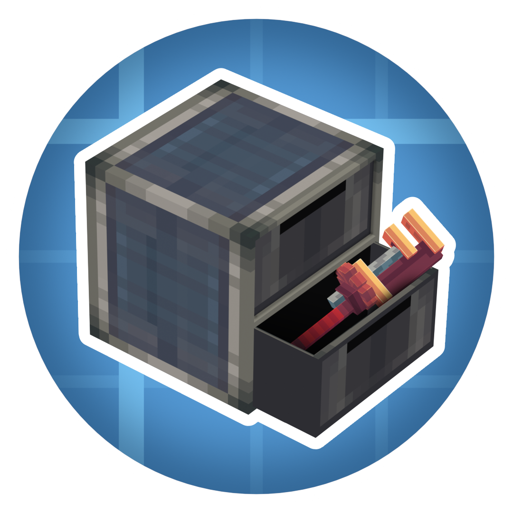

  
  <h1>Create: Item Drawers</h1>
  
  

 

**Create: Item Drawers** is a Create addon which adds the usual drawers for storage, but with a Create flair.  

## Features

### Usage
Right-Click on a slot while holding an item to insert it.  
Sneak + Right-Click to insert all matching items from your inventory into the slot.  
Left-Click a slot to take out a single item stored.  
Sneak + Left-Click to take our a stack at a time.

### Settings
Right-Click the front of a drawer with a Wrench to open the settings for said drawer.  
Here you can insert upgrades to increase the capacity, as well as toggle lock and void modes for each individual slot. You can also hide items, the amount, or upgrade icons etc., if you wish.  
No need for an additional item to lock/void your drawers!

**Lock mode**:  
    When enabled, keeps the stored item as a template even when the slot is emptied out. Prevents other items from being inserted into the slot.

**Void mode**:  
    When enabled, deletes excess items inserted into the drawer. Helpful to prevent overflow.

### Upgrades
Upgrades allow you to increase the total capacity of a drawer. The upgrade affects all slots in the drawer.  
If you remove an upgrade and max capacity ends up being less than what is currently stored in a slot, then said slot is "frozen" until an upgrade of high enough tier is inserted again.  
Comes with 5 tiers of upgrades.

### Networks
By using a wrench on two drawers next to each other, you can connect them (similar to Mechanical Crafters from base Create). This lets you create Drawer networks where components that can insert/extract items can do so from a single point.

### Configuration
**Client Side**:  
- Settings to configure the distance at which items, counts, and icons (lock/void/upgrade) are shown.  
Also able to disable the rendering of these globally if you wish to for some reason.  
- Setting to enable Engineer's Goggles overlay to see details such as stored items, lock/void modes etc. while wearing the goggles. Can additionally set it to require holding a Wrench as well if you wish. Both are disabled by default to not clutter the HUD too much.

**Server Side**:  
- Settings to adjust the base capacity of each of the three drawer types. The capacity is measured in stacks - eg. a base capacity of 32 means it can store 32 stacks (A stack of Cobblestone is 64, so 32\*64=2048, while a stack of Ender Pearls is 16, so 32\*16=512)  
- Settings to adjust the upgrade multipliers. Pretty straightforward, they multiply the base capacity.
- Settings to adjust slowness debuff when having Drawers with items stored in the player inventory.

## Other Info
### Modpack permission
You're more than welcome to include it in your modpack.

### Porting and Forking
This was mainly made for myself and some friends, and as such I have no plans to port to other modloaders, or port to previous versions.  
I will try and see if I can at least keep it updated for the latest Create version on the most recent Minecraft version (At the moment, 1.21.1).

Otherwise, feel free to fork it and port yourself.

### New features / Suggestions
You're welcome to suggest things, but as mentioned above this was mainly made for myself and some friends, so I can't promise I'll dedicate a lot of effort to add suggested features.

## Credits
A general huge thanks to the modding community for all the open source tools to use and projects to learn from!  
- [Create](https://github.com/Creators-of-Create/Create)  
  For the main mod of course.
- [Storage Drawers](https://github.com/jaquadro/StorageDrawers), [Functional Storage](https://github.com/Buuz135/FunctionalStorage), [Create: Storage \[Neo/Forge\]](https://github.com/ausmez/create-storage-neo-forge)  
  Some of the relevant mods I learned from and was inspired by.
